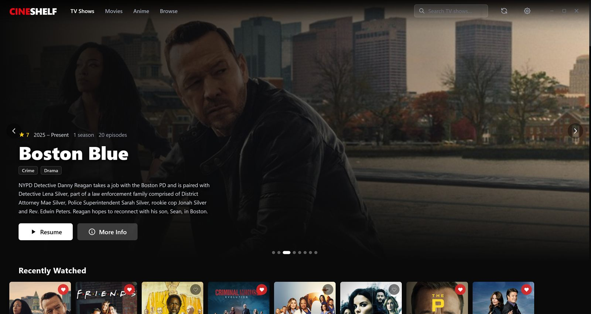
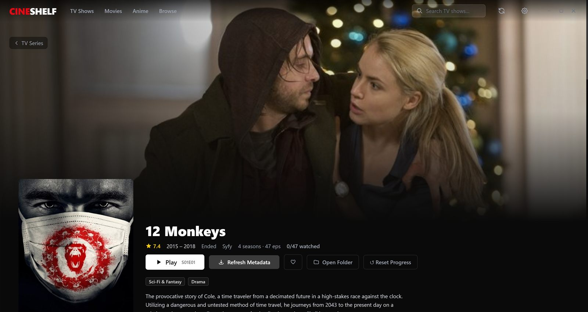
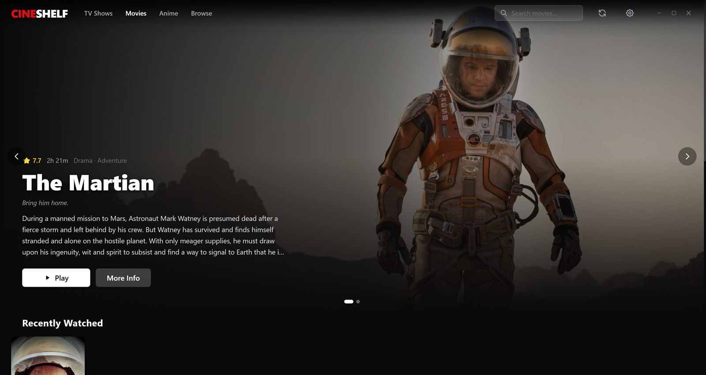
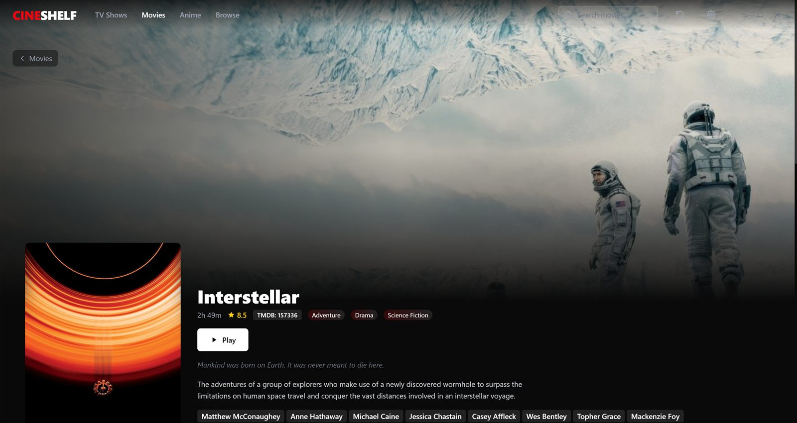
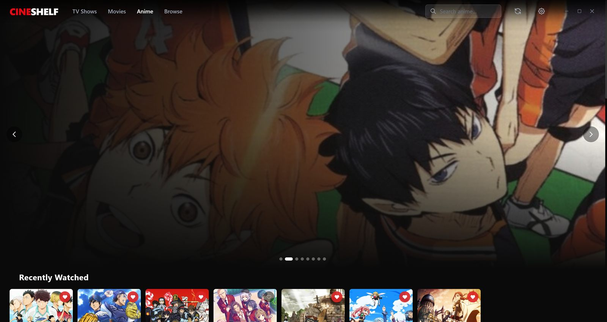
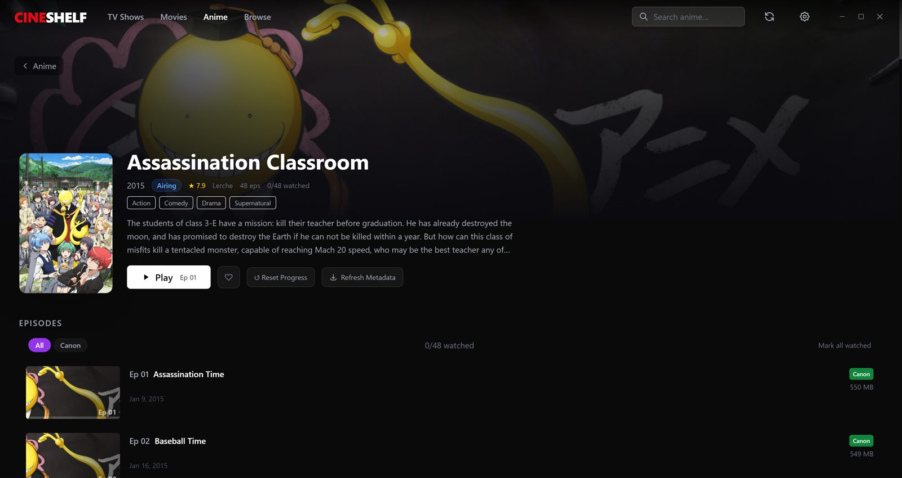
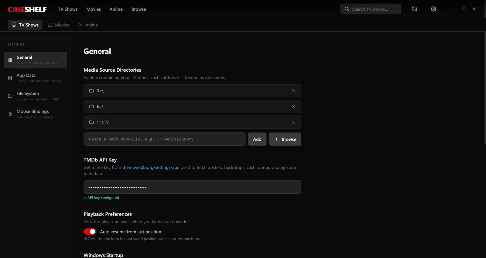
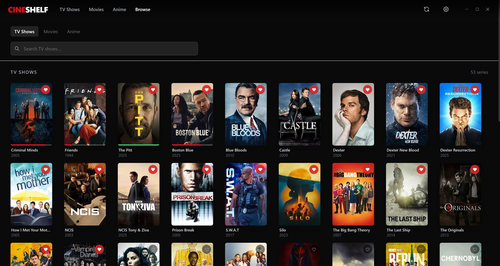
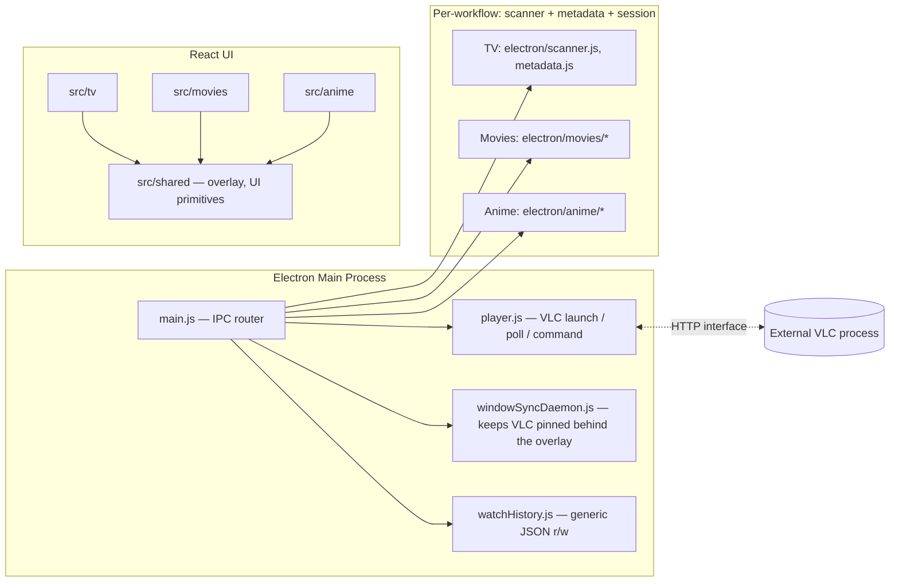

<div align="center">

# 🎬 CineShelf

**A local, personal media library with a Netflix-style UI — TV Shows, Movies, and Anime, played through VLC with a custom on-screen overlay.**


</div>

---

## What this is

CineShelf turns a folder of TV shows, movies, and anime sitting on local or external drives into a Netflix-like library: posters, backdrops, cast, ratings, per-episode watch progress, resume-from-last-position, favorites, and custom home-screen shelves — all running entirely offline against your own files, with no cloud account and no subscription.

It doesn't reimplement a video player. When you hit Play, CineShelf launches a real external **VLC** process (controlled over VLC's own HTTP interface) and draws a transparent, always-on-top **Electron overlay** on top of it for all of the playback UI — progress bar, episode switching, audio/subtitle tracks, aspect ratio, and mouse/keyboard bindings via a small AutoHotkey script. VLC does the decoding; CineShelf owns everything you see and click.

This is a personal project built and used daily to organize and watch a real library — the screenshots below are the actual app, running against a real (if idiosyncratic) collection.

## Screenshots

<table>
<tr>
<td width="50%">

**TV Shows — Home**


</td>
<td width="50%">

**TV Shows — Series Detail**


</td>
</tr>
<tr>
<td width="50%">

**Movies — Home**


</td>
<td width="50%">

**Movies — Detail**


</td>
</tr>
<tr>
<td width="50%">

**Anime — Home**


</td>
<td width="50%">

**Anime — Detail (canon/filler filtering)**


</td>
</tr>
<tr>
<td width="50%">

**Settings**


</td>
<td width="50%">

**Browse (cross-workflow search)**


</td>
</tr>
</table>

## Features

- **Three independent library types** — TV Shows, Movies, and Anime each get their own scanner, metadata source, home screen, and settings — built and evolved separately by design (see [ARCHITECTURE.md](ARCHITECTURE.md)).
- **Automatic metadata & artwork** — TMDB for TV/Movies (TVMaze as fallback), AniList → Jikan → TMDB for Anime. Posters, backdrops, cast, ratings, genres, and episode stills are fetched once and cached to disk; the app works fully offline afterward.
- **Real VLC playback, not a bundled player** — launches your installed VLC, drives it over HTTP, and overlays a fully custom, click-through-aware UI on top for controls, episode navigation, audio/subtitle track selection, aspect ratio, and cropping.
- **Watch history & resume** — per-episode position tracking, a 90%-complete threshold, auto-resume, and a series-completion counter.
- **Custom home-screen shelves** — drag-and-drop rows, favorites, and a "Hall of Fame" tag, independently per workflow.
- **Anime-aware scanning** — absolute episode numbering, OVA/special detection, and canon/filler/mixed episode filtering that also drives what the playlist actually plays.
- **Mouse & keyboard bindings** — an auto-generated, auto-installed AutoHotkey script maps mouse buttons to playback actions, scoped to the player window only.
- **Resilient to disconnected drives** — series/movies on an unplugged external drive are preserved (greyed out, marked unavailable) rather than disappearing from the library.

## Tech stack

| Layer | Stack |
| --- | --- |
| Shell | [Electron](https://www.electronjs.org/) 27 |
| UI | React 18, React Router (HashRouter), Tailwind CSS, Framer Motion, `@dnd-kit` |
| Playback | External VLC, driven via its HTTP interface |
| Metadata | TMDB, TVMaze, AniList GraphQL, Jikan (MyAnimeList) |
| Local storage | Flat JSON files under Electron's `userData` directory — no database |
| Input bindings | AutoHotkey v2 (auto-generated script) |

## Architecture, in brief

CineShelf is built around one rule: **TV Shows, Movies, and Anime are three parallel, deliberately-duplicated workflows that don't share code**, except through a small, explicit set of shared files (VLC control, the overlay shell, generic watch-history I/O) and three "intersection point" screens (the router, the cross-workflow Settings shell, and the cross-workflow Browse page).



For the full picture — the isolation rule, the exact IPC channel map, the `session.js` launch contract, and known drift between older design docs and the current code — see:

- **[ARCHITECTURE.md](ARCHITECTURE.md)** — master structural reference
- **[docs/electron-architecture.md](docs/electron-architecture.md)** — IPC channels, data paths, safe-modification rules
- **[docs/watch-history.md](docs/watch-history.md)**, **[docs/metadata-and-images.md](docs/metadata-and-images.md)**, **[docs/app-data.md](docs/app-data.md)** — data model deep dives
- **[docs/progressive-updates-overview.md](docs/progressive-updates-overview.md)** — what's changed since the original architecture snapshot
- **[CLAUDE.md](CLAUDE.md)** — orientation notes for AI coding agents working in this repo, including a map of every doc above and where they've drifted from the actual code

## Running it locally

CineShelf is built for personal use on Windows, with VLC and a local media collection. To run it yourself:

```bash
git clone https://github.com/akash-verma-au16/CineShelf.git
cd CineShelf
npm install
cp .env.example .env   # then fill in TMDB_API_KEY — get a free key at https://www.themoviedb.org/settings/api
npm run dev            # starts the React dev server + Electron together
```

Requirements:

- **Windows** (the overlay, VLC window management, and AutoHotkey integration are Windows-specific)
- **[VLC media player](https://www.videolan.org/vlc/)** installed
- A **TMDB API key** (free) for TV/Movie metadata — Anime metadata works without one (AniList/Jikan need no key)
- Point the app at your media folders from Settings, then Scan

Other scripts: `npm run build` (production React build), `npm run dist` (packages a Windows installer via `electron-builder`).

## Project status & scope

This is a living personal project, not a polished distributable product — expect Windows-only assumptions, a personal folder-naming convention baked into the scanners, and rough edges. TV Shows is the oldest and most stable workflow; Movies and Anime were built out afterward using the same patterns (see [docs/expansion-playbook.md](docs/expansion-playbook.md)) and are still evolving.

---

<div align="center">

All rights reserved. This repository is public for portfolio and reference purposes — the code is visible, but not licensed for reuse or redistribution.

</div>
